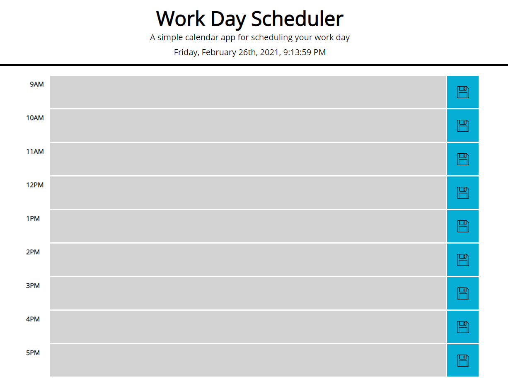

# Work Day Scheduler Application
## Simple calendar application that allows a user to save events for each hour of the day using HTML, CSS, and jQuery.
## by Michael Bussert
### GitHub: [mbussert](https://github.com/mbussert) | Email: mbussert@gmail.com

## Links:
Deployed application:  https://mbussert.github.io/work-day-scheduler/  
GitHub Repository: https://github.com/mbussert/work-day-scheduler

## Description:
---------------------------------
A work day scheduling application created using HTML, CSS, jQuery, Bootstrap, and Moment.js. Each row will update either gray (past), red (current hour), or green (future), automatically based on the time of day. The user is able to enter in as many notes or tasks as they wish and clicking the save icon will save each note to local storage on the user's machine.

----------------------------------------
## Screenshots

### Pageload -- After 6pm

### Morning 

